<h1 align="center">Planet-i-Green</h1>

<p align="center">
  <strong>Point a camera at a plant. Understand it, care for it, and help the planet while you do.</strong><br/>
  An installable, mobile-first plant-health companion with AI diagnosis, self-building care reminders,
  weather alerts, growth tracking and a privacy-first community map.
</p>

<p align="center">
  <a href="docs/demo/planet-i-green-demo.mp4">
    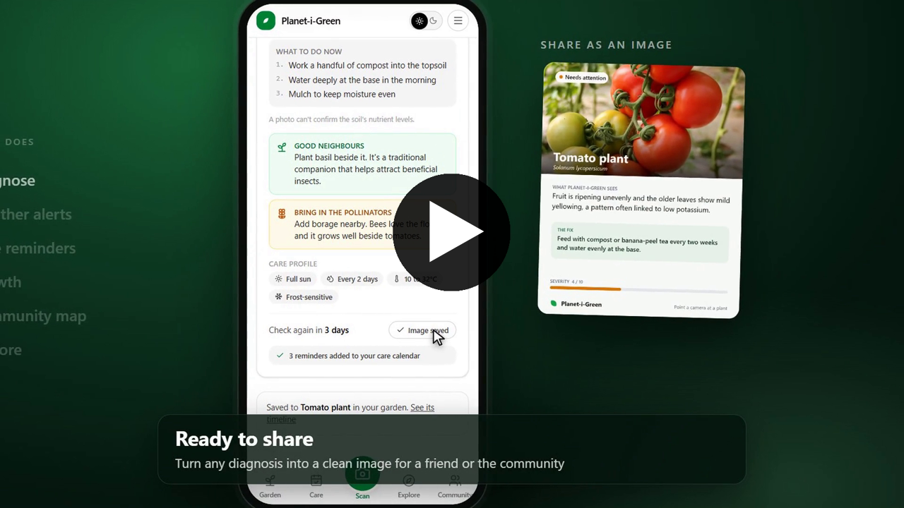
  </a>
  <br/>
  <sub>Watch the 2 minute demo (<a href="docs/demo/planet-i-green-demo.mp4">mp4</a>)</sub>
</p>

---

## Why it exists

Most plant apps stop at "here is a name". Planet-i-Green answers the three questions people actually have: **what is
happening, what should I do now, and what should I check next**, and it nudges every gardener toward choices that
are good for nature.

| Good for plants | Good for the planet | Good for you |
|---|---|---|
| Severity score and plain-language causes | Gentle, low-cost fixes first, so fewer harsh chemicals | Reminders build themselves from each scan |
| A trend line: is it recovering? | Companion and pollinator-friendly plant suggestions | Installs like an app, works offline |
| Frost, heat and heavy-rain alerts per plant | Skip watering before heavy rain, so less water wasted | Location is blurred on your device before it is saved |
| Care profile per plant | Green actions: compost, mulch, rainwater, pollinator patches | Light and dark themes, one-thumb navigation |

## Screens

<table>
  <tr>
    <td align="center">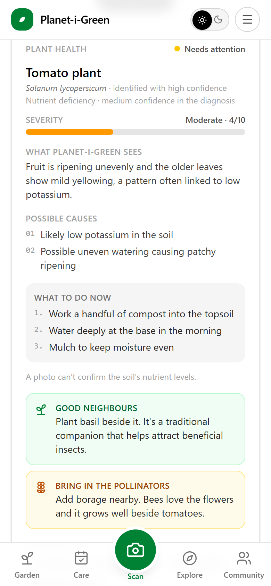<br/><sub><b>Diagnosis</b><br/>severity, causes, fixes</sub></td>
    <td align="center">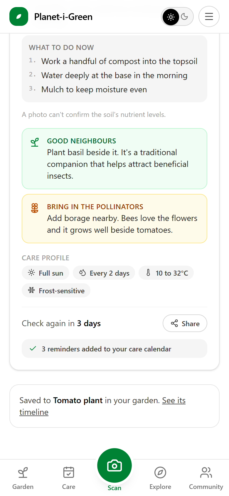<br/><sub><b>Good neighbours</b><br/>companion and pollinator tips</sub></td>
    <td align="center">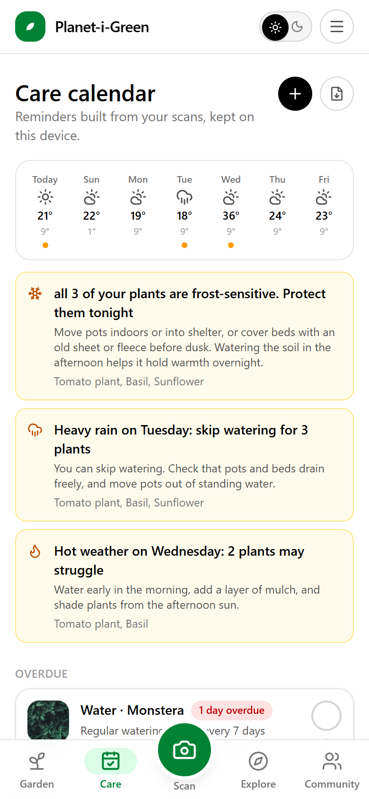<br/><sub><b>Care calendar</b><br/>forecast and weather alerts</sub></td>
    <td align="center">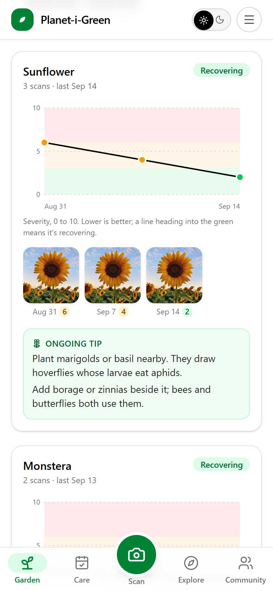<br/><sub><b>Growth</b><br/>severity over time</sub></td>
  </tr>
  <tr>
    <td align="center">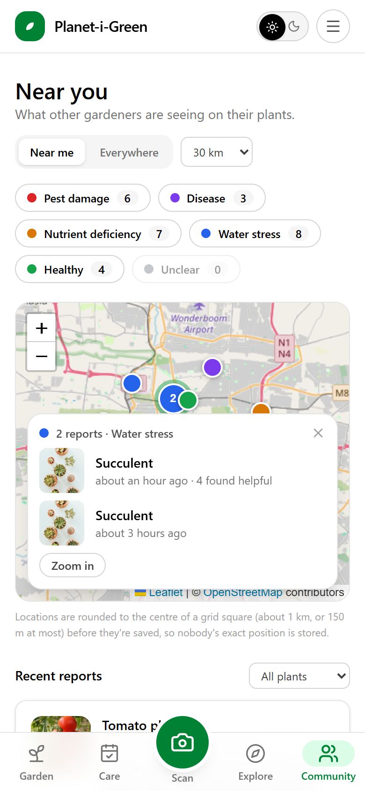<br/><sub><b>Community map</b><br/>pins merged by issue type</sub></td>
    <td align="center">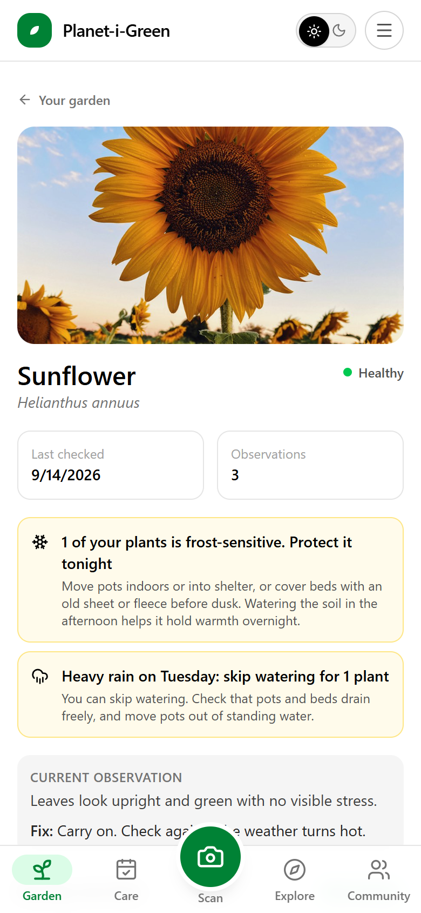<br/><sub><b>Plant page</b><br/>profile, alerts, timeline</sub></td>
    <td align="center">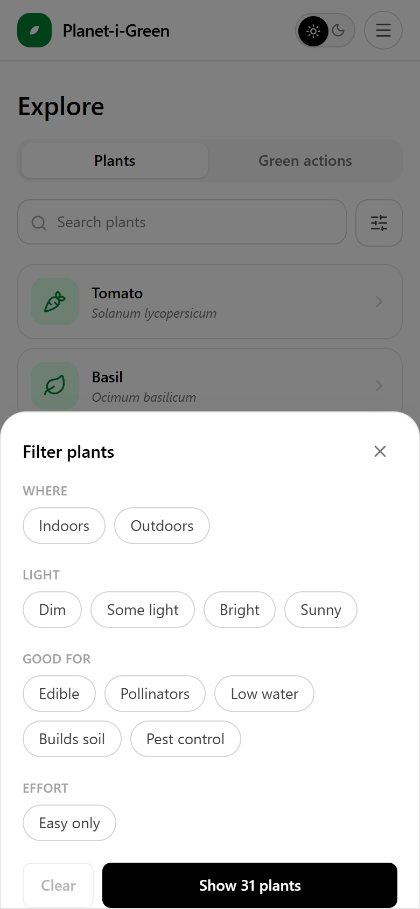<br/><sub><b>Plant guide</b><br/>search with a filter popup</sub></td>
    <td align="center">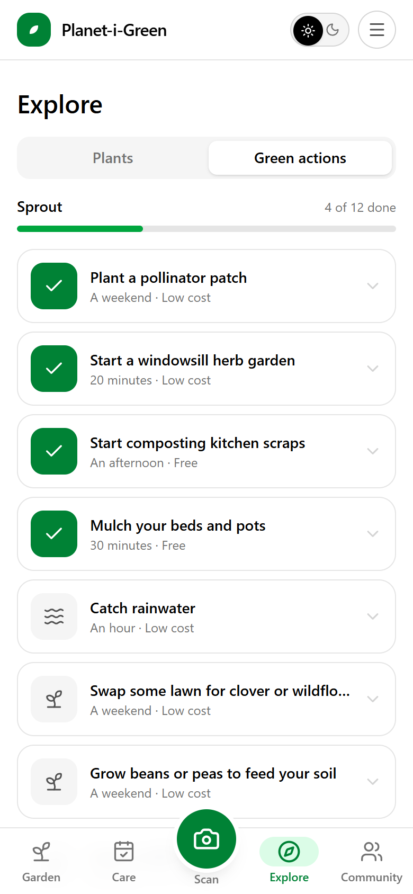<br/><sub><b>Green actions</b><br/>simple progress, nothing invented</sub></td>
  </tr>
  <tr>
    <td align="center">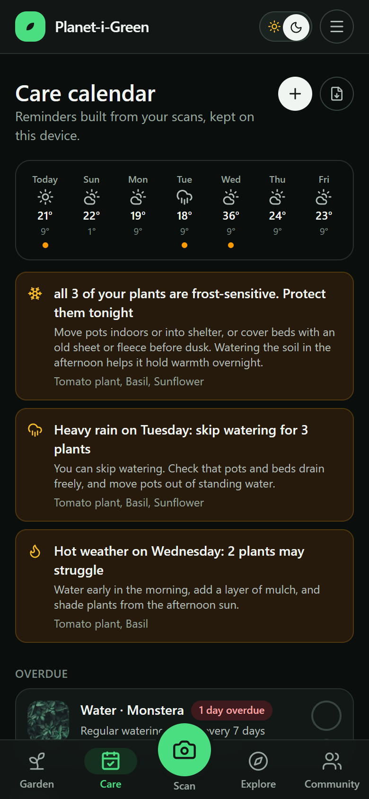<br/><sub><b>Dark mode</b></sub></td>
    <td align="center">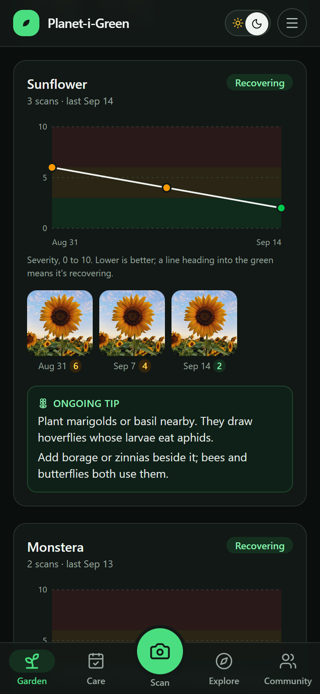<br/><sub><b>Dark growth</b></sub></td>
    <td align="center">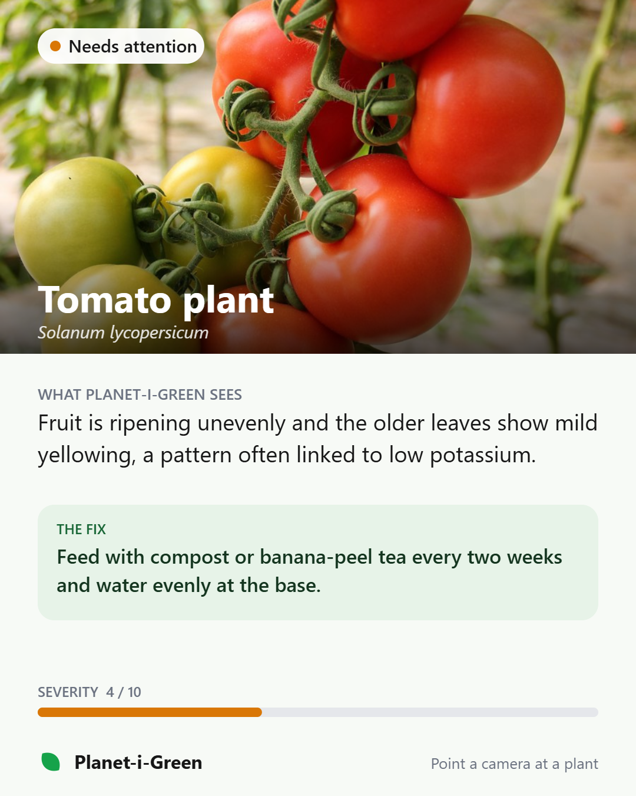<br/><sub><b>Share card</b><br/>a diagnosis as an image</sub></td>
    <td align="center">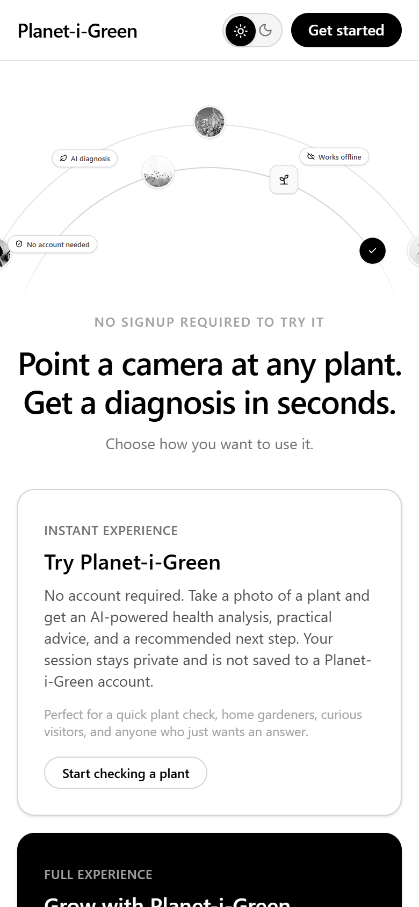<br/><sub><b>Landing</b><br/>demo or full platform</sub></td>
  </tr>
</table>

<p align="center">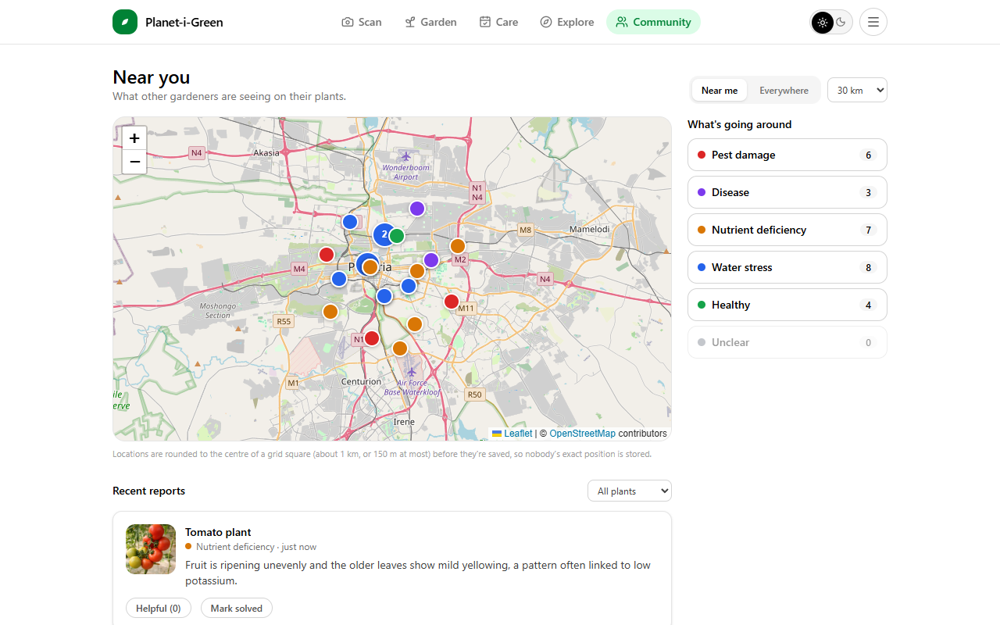</p>

## Two ways to use it

| | **Instant demo** | **Full platform** |
|---|---|---|
| Account | None | Anonymous Supabase session |
| AI | Your own Claude, OpenAI or Gemini key, called straight from the browser. Never stored or sent anywhere else. | One operator-configured provider, switchable in Settings with no redeploy |
| Data | Stays in this browser (IndexedDB) | Plants, reports and photos in Postgres and Storage |
| Includes | Scan, plant guide, green actions | Everything: garden, calendar, alerts, growth, community map |
| Backend needed | No | Yes, see [SUPABASE_SETUP.md](SUPABASE_SETUP.md) |

## How it works

### System overview

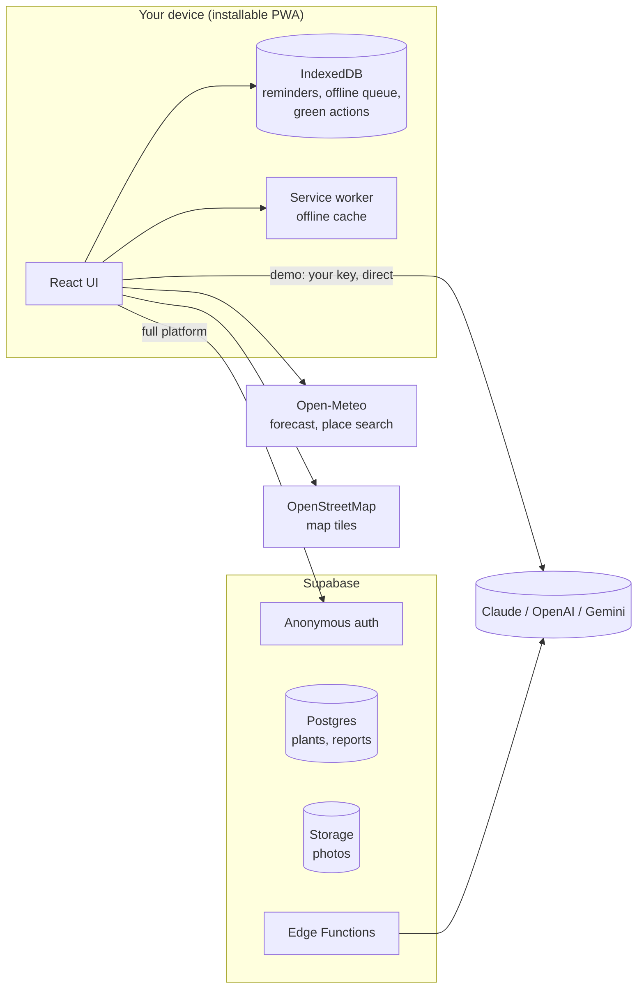

### From a photo to a care plan

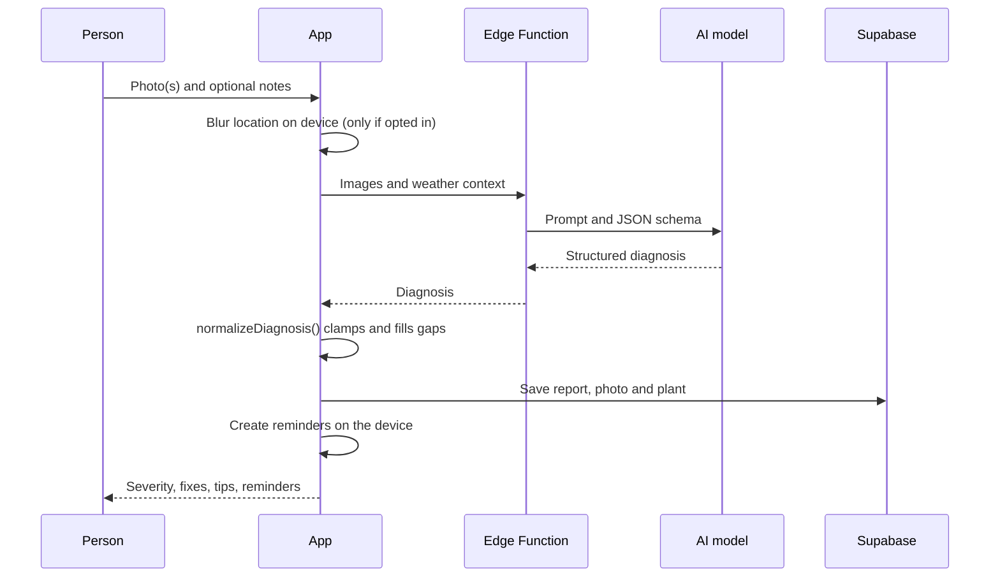

The diagnosis is a **structured object, not prose**: plant and scientific name with identification confidence, issue
category, a 0 to 10 severity score, ranked causes, ordered low-cost actions, urgency, follow-up window, one companion tip,
one pollinator-friendly suggestion, a care profile, and suggested tasks. `normalizeDiagnosis` guarantees every field
is present and in range, so the UI never handles a partial result.

### Reminders that build themselves

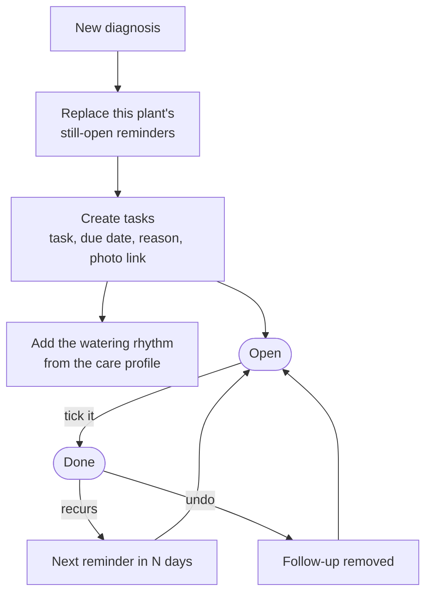

### Weather alerts

Alerts are computed per plant from a 7-day Open-Meteo forecast (no API key). Indoor plants are never flagged, and
frost warnings only fire for plants whose care profile says they are frost-sensitive.

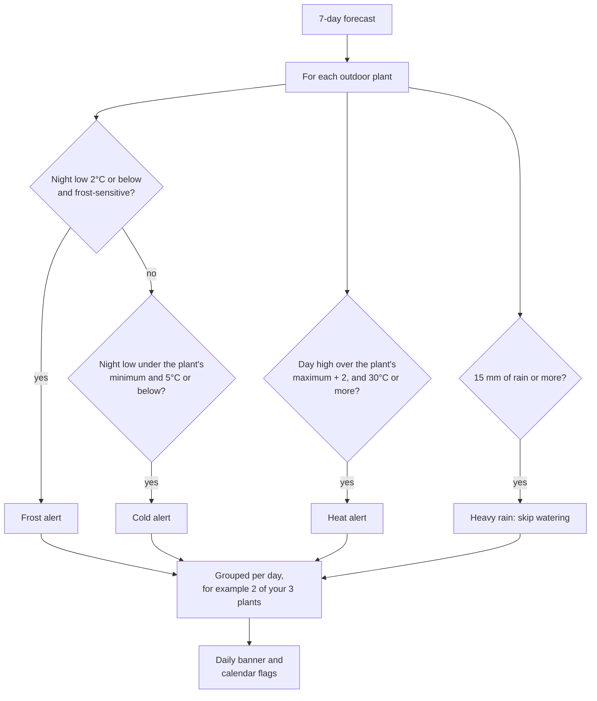

### Location privacy

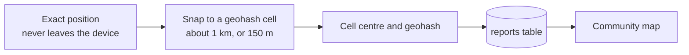

Sharing is **off by default**. When on, the position is rounded on the device first, so the server never holds an
exact location. Older exact coordinates are rounded by the migration.

### Care profiles

A profile (light, watering interval, temperature range, frost sensitivity) is resolved in this order, and the UI
says which one it is:

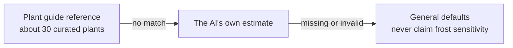

### Data model

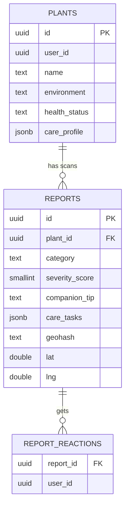

`secrets` and `app_config` hold the operator's AI keys and active provider. Row Level Security gives clients no
access; only Edge Functions using the service role can read them.

## Quick start

```bash
npm install
npm run dev          # open the app and choose "Try Planet-i-Green"
```

The demo needs nothing else. For the full platform, follow **[SUPABASE_SETUP.md](SUPABASE_SETUP.md)** (create the project,
`npx supabase db push`, `npx supabase functions deploy`, add a key in Settings).

```bash
npm run build        # production build, then host dist/ on any static host over HTTPS
npm run lint
```

Installing as an app needs the production build over HTTPS. Android and desktop Chrome/Edge offer an install button in
the menu; iPhone and iPad show the Share-sheet steps.

## Tech

| Layer | Choice |
|---|---|
| UI | React 19, Vite, Tailwind v4, Framer Motion, Lucide icons |
| Offline and installable | vite-plugin-pwa (Workbox), Dexie (IndexedDB) |
| Maps | Leaflet and OpenStreetMap, loaded only on the community page |
| Backend | Supabase: Postgres, anonymous Auth, Storage, Edge Functions (Deno) |
| AI | Claude, OpenAI or Gemini behind one adapter interface and one shared JSON schema |
| Weather | Open-Meteo forecast and geocoding (no keys) |

## Project layout

```
src/
  components/   DiagnosisCard, SeverityChart, CommunityMap, WeatherBanner, NavBar, Sheet, explore/, ...
  hooks/        useMyPlants, useWeatherAlerts, useSavedLocation, useLiveQuery
  lib/          diagnosis.ts, careTasks.ts, weather.ts, weatherAlerts.ts, geo.ts, plantCatalog.ts,
                greenActions.ts, shareCard.ts, sync.ts, theme.tsx, install.ts, ...
  pages/        Diagnose, Plants, PlantDetail, CareCalendar, Community, Growth, Explore, Report, Settings
supabase/
  migrations/   schema, then the additive feature migration
  functions/    diagnose-plant (requires sign-in), provider and key management, _shared/
scripts/        generate-icons.mjs
docs/           screenshots and the demo video
```

The diagnosis prompt and JSON Schema live in **two identical files**, `src/lib/diagnosisSchema.ts` (browser demo)
and `supabase/functions/_shared/schema.ts` (Deno). Edit both together. Gemini's schema is generated from the same
JSON Schema, so it cannot drift.

**Adding an AI provider:** write an adapter in `supabase/functions/_shared/providers/` with the same signature,
register it in the `PROVIDERS` map, and redeploy. It appears in Settings automatically.

## Design principles

- **Calm by default.** Lists show a name; detail sits one tap in; secondary detail is collapsed. No emojis.
- **Honest AI.** Cautious wording, a stated limitation, and separate confidence for identification and diagnosis.
- **Nothing invented.** The green-actions tally counts only what the app can count. It does not estimate carbon or trees.
- **Private by design.** Blurred location, opt-in sharing, keys never in client storage.

## Known limits

- Not built yet: treatment tracking beyond reminders, pest-specific categories, before/after photo comparison, push
  notifications, a dashboard home screen.
- Windows: `npm run build` can fail at the PWA step with a `@rollup/rollup-win32-x64-msvc` error. That is Windows
  Defender removing a native binary ([npm issue](https://github.com/npm/cli/issues/4828)), not a code problem.
  Exclude `node_modules` in Defender, then `rm -rf node_modules/@rollup && npm install`. `npm run dev` is unaffected.

## License

MIT, see [LICENSE](LICENSE).
